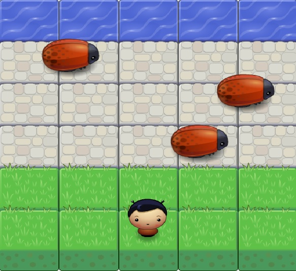

<h1> frontend-nanodegree-arcade-game V.2 23/01/2018 
===============================</h1>

<h1> Introduction </h1>

 this is my 5th projct for frontend nanodegree and you can test yourself if you know Javascript from <a href="https://github.com/aaaalrashd/frontend-nanodegree-arcade-game-Challenge">here</a>

<h1> Installation </h1>

 Clone the file or download it for your computer ad runnig it prees <a href="https://github.com/aaaalrashd/frontend-nanodegree-arcade-game-Challenge" >here</a> 

<h1> Requried Things </h1>

 You need a new version of browsers and you must have a keyboard to move and Please turn on your computer speakers for more fun

<h1> How to Win in the game </h1>

in this Game , you must move to arrive the TOP (Water) for win
in the first You must go beyond the bug
you can move by arrows or  "A,W,D,S"
    Have a nice game :) 

<h1> Contact </h1>

You can contact with me :

<ul>
<li>Email: aaaalrashd@gmail.com</li>
<li>Mobile : +966561113041</li>
<li>Github: aaaalrashd</li>
</ul>

================================

frontend-nanodegree-arcade-game V.2 23/01/2018

